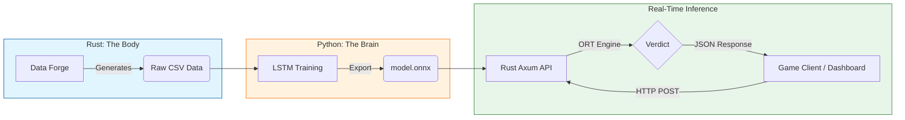

# 🎯 Project Aimbot Hunter

> **"To catch a machine, you must first understand what makes us human."**
> An Industrial-Grade Deep Learning system that detects FPS game cheaters (Aimbots) in real-time using **Rust**, **ONNX Runtime**, and **LSTM Autoencoders**.

---

## 📖 About The Project

In FPS games, traditional anti-cheat systems often rely on scanning memory signatures or processes. **Aimbot Hunter** takes a different approach: **Behavioral Biometrics**.

We operate on a core hypothesis: **Human mouse movement contains natural "noise," micro-corrections, and inertia. Machine movement (whether simple Linear interpolation or advanced Bezier curves) is mathematically "too perfect" or algorithmic.**

This project has evolved into a full-stack AI microservice:

1.  **Rust Tools (The Body)**: High-performance tools for data generation and a **low-latency REST API** (<5ms) powered by Microsoft's ONNX Runtime.
2.  **Python Brain (The Mind)**: An LSTM Autoencoder model that learns the "fingerprint" of human movement.
3.  **Command Center (The Eyes)**: A Streamlit dashboard for real-time trajectory visualization and threat analysis.

---

## 🏗️ System Architecture

The project follows a modular pipeline that decouples **training** from **production inference**.



### 1. Data Layer (Rust)

* **Forge**: We use `data-forge` to mathematically synthesize millions of rows of linear and Bezier bot trajectories.
* **Logger**: `mouse-logger` captures high-frequency human input (1000Hz+).

### 2. Training Layer (Python)

* **Model**: An **LSTM Autoencoder** trained on human data.
* **Logic**: The model attempts to reconstruct movement. High reconstruction error (MSE) = Aimbot.

### 3. Deployment Layer (Rust + ONNX)

* **Engine**: We serve the model using **Rust (Axum)** and **ONNX Runtime (ORT)**.
* **Performance**: Achieves **<5ms latency** per request, suitable for real-time server-side anti-cheat.

---

## 📂 Project Structure

```text
aimbot-hunter/
│
├── 📂 rust-tools/                   # High-Performance Core
│   ├── 📦 aimbot-api/               # [NEW] Real-time Inference Server (Axum + ORT)
│   ├── 📦 data-forge/               # Data generator
│   ├── 📦 mouse-logger/             # Human data recorder
│   ├── 📦 linear-bot/               # Linear aimbot simulation
│   └── 📦 bezier-bot/               # Bezier aimbot simulation
│
├── 📂 python-brain/                 # AI Lab
│   ├── 📓 aimbot_hunter.ipynb       # Training Notebook
│   ├── 🧠 model.onnx                # Exported Production Model
│   └── ⚖️ scaler.save               # Data Scaler
│
├── 🕹️ dashboard.py                  # [NEW] Streamlit Command Center
├── 🧪 test_attack.py                # Latency & Attack Simulation Script
└── 📄 README.md                     # Documentation

```

---

## 🚀 Quick Start Handbook

### Prerequisites

* **Rust**: `curl --proto '=https' --tlsv1.2 -sSf https://sh.rustup.rs | sh`
* **Python 3.9+**: `pip install streamlit pandas requests`
* **ONNX Runtime**: (The Rust crate handles this automatically)

### Phase 1: Train the Brain

*(Skip this if you already have `model.onnx`)*

1. Navigate to `python-brain/`.
2. Run the notebook or script to train the LSTM.
3. **Crucial**: Export the trained Keras model to ONNX format.

### Phase 2: Start the Engine (Rust API)

This starts the high-performance inference server.

1. Navigate to the API directory:
```bash
cd rust-tools/aimbot-api

```


2. Ensure `model.onnx` and `config.json` are present in this folder.
3. Launch the server (Release mode for speed):
```bash
cargo run --release

```


*Output: `🚀 SERVER RUNNING ON http://localhost:3000*`

### Phase 3: Launch Command Center (Visualization)

Open a new terminal to launch the visual dashboard.

1. Navigate to the project root:
```bash
cd ../..

```

2. Run the Streamlit app:
```bash
streamlit run dashboard.py

```

3. Open your browser to visualize Human vs. Aimbot trajectories in real-time!

---

## 📊 Performance Benchmarks

| Metric | Python (Flask/FastAPI) | Rust (Axum + ORT) | Improvement |
| --- | --- | --- | --- |
| **Latency** | ~25ms - 50ms | **2ms - 5ms** | **10x Faster** |
| **Throughput** | Low | High (Async) | High Concurrency |
| **Memory** | High Overhead | Minimal | Efficient |

> **Note**: Rust's zero-cost abstractions allow us to run complex LSTM inference with negligible overhead.

---

## 🛠️ Tech Stack

* **Backend**: Rust, Axum, Tokio, ONNX Runtime (ORT)
* **AI**: TensorFlow/Keras (Training), ONNX (Inference)
* **Frontend**: Streamlit, Altair
* **Data**: Polars, Serde

---

## 🤝 Contribution & License

This project is open-source under the MIT License.

**Disclaimer**: This project is for **educational and research purposes only**.
