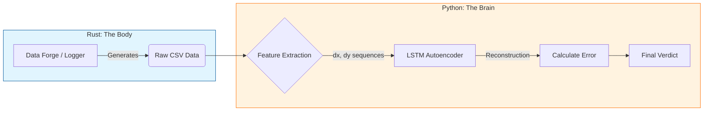

# 🎯 Project Aimbot Hunter

> **"To catch a machine, you must first understand what makes us human."**
> A Deep Learning system that detects FPS game cheaters (Aimbots) by analyzing mouse movement patterns using **LSTM Autoencoders**.

---

## 📖 About The Project

In FPS games, traditional anti-cheat systems often rely on scanning memory signatures or processes. **Aimbot Hunter** takes a different approach: **Behavioral Biometrics**.

We operate on a core hypothesis: **Human mouse movement contains natural "noise," micro-corrections, and inertia. Machine movement (whether simple Linear interpolation or advanced Bezier curves) is mathematically "too perfect" or algorithmic.**

This project consists of two main components:

1. **Rust Tools (The Body)**: A high-performance suite for capturing mouse data and mathematically simulating massive datasets of bot behaviors.
2. **Python Brain (The Mind)**: An LSTM Autoencoder model that learns the "fingerprint" of human movement and flags anomalies.

---

## 🏗️ System Architecture

The project follows a modular pipeline that decouples **high-performance data generation** from **deep learning inference**.



### 1. Data Layer (Rust)

* **Source**: We use `data-forge` to mathematically synthesize millions of rows of linear and Bezier bot trajectories in milliseconds, and `mouse-logger` to capture high-frequency human input (1000Hz+).
* **Output**: Raw time-series data `(timestamp, x, y)` stored in CSV format.

### 2. Processing Layer (Python)

* **Feature Engineering**: The raw coordinates are converted into **relative deltas** `(dx, dy)`. This makes the model "position-invariant," meaning it focuses on *how* the mouse moves, not *where* it is on the screen.
* **Normalization**: Data is scaled to a `0-1` range to ensure stable LSTM convergence.

### 3. Intelligence Layer (The "Judge")

* **Model**: An **LSTM Autoencoder** trained exclusively on human data.
* **The Logic**:
* The model attempts to compress and reconstruct every movement sequence it sees.
* **Low Error**: The movement matches the learned "human" patterns.
* **High Error**: The movement is mathematically foreign (algorithmic), flagging it as an **Aimbot**.

## 📂 Project Structure

```text
aimbot-hunter/
│
├── 📂 data/                         # Datasets (The Evidence)
│   ├── golden_human.csv             # Recorded human gameplay
│   ├── golden_linear.csv            # Generated Linear bot data
│   └── golden_bezier.csv            # Generated Bezier bot data
│
├── 📂 rust-tools/                   # The "Body": Simulation & I/O
│   ├── 📦 data-forge/               # [CORE] High-speed data generator
│   ├── 📦 mouse-logger/             # Windows hook for recording
│   ├── 📦 linear-bot/               # Linear aimbot simulation
│   └── 📦 bezier-bot/               # Bezier aimbot simulation
│
├── 📂 python-brain/                 # The "Mind": AI Lab
│   ├── 📓 aimbot_hunter.ipynb       # [CORE] All-in-one Notebook (Train + Judge)
│   ├── 🧠 aimbot_hunter_model.h5    # Trained Model (Imported from Colab)
│   ├── ⚖️ scaler.save               # Data Scaler (Imported from Colab)
│   ├── 🖼️ final_verdict.png         # Result Chart (Imported from Colab)
│   └── 📄 requirements.txt          # Python dependencies
│
└── 📄 README.md                     # Project documentation

```

---

## 🚀 Quick Start Handbook

### 0. Prerequisites

* **Rust**: `curl --proto '=https' --tlsv1.2 -sSf https://sh.rustup.rs | sh`
* **Python 3.9+**: (Virtual Environment recommended)
* **Git**: Version Control.

### Phase 1: The Data Forge (Rust)

To bypass OS-level hook limitations and generate massive datasets instantly, we use the `data-forge` tool. It simulates hours of gameplay math in milliseconds.

1. Navigate to the Rust tools directory:

```bash
cd rust-tools

```

2. **Forge the Data** (Generates `golden_linear.csv` and `golden_bezier.csv`):

```bash
cargo run -p data-forge

```

3. *(Optional)* To record real human gameplay:

```bash
cargo run --release -p mouse-logger
# Play an FPS game for a few minutes. Data saves to ../data/captured.csv
# Rename it to golden_human.csv manually.

```

### Phase 2: Training the Brain (Python)

You can train the model locally or on Google Colab.

1. Navigate to the Python directory and install dependencies:

```bash
cd python-brain
pip install -r requirements.txt

```

2. **Train the Model**:

* **Option A (Recommended)**: Upload data to Google Colab, run `train_brain.ipynb`, then download the `.h5` model and `.save` file back to this folder.
* **Option B (Local)**: Run the script directly:

```bash
python train_brain.py

```

3. **Goal**: Achieve a validation loss of `0.00xx`.

### Phase 3: Judgment Day (Evaluation)

We feed Human, Linear Bot, and Bezier Bot data into the AI to see if it can distinguish them.

1. Run the judgment script:

```bash
python judge_bot.py

```

2. **Analyze the Result**:
The script generates `final_verdict.png`.

* **Blue Peak (Human)**: Should be on the left (Low Error).
* **Orange/Green Peaks (Bots)**: Should be on the right (High Error).
* **The Gap**: This is your detection threshold.

---

## 📊 Demo Result

*(Example output of `final_verdict.png`)*

> As shown above, the AI successfully separates genuine Human players (Error < 0.05) from Linear and Bezier scripts (Error > 0.10).

---

## 🛠️ Tech Stack

* **System & IO**: Rust (Enigo, Rdev, Serde)
* **Deep Learning**: TensorFlow / Keras (LSTM)
* **Data Analysis**: Pandas, NumPy
* **Visualization**: Matplotlib, Seaborn

---

## 🤝 Contribution & License

This project is open-source under the MIT License. Pull requests to improve bot algorithms or model architecture are welcome.

**Disclaimer**: This project is for **educational and research purposes only**. Do not use the provided bot scripts in online competitive games where it violates the Terms of Service.
